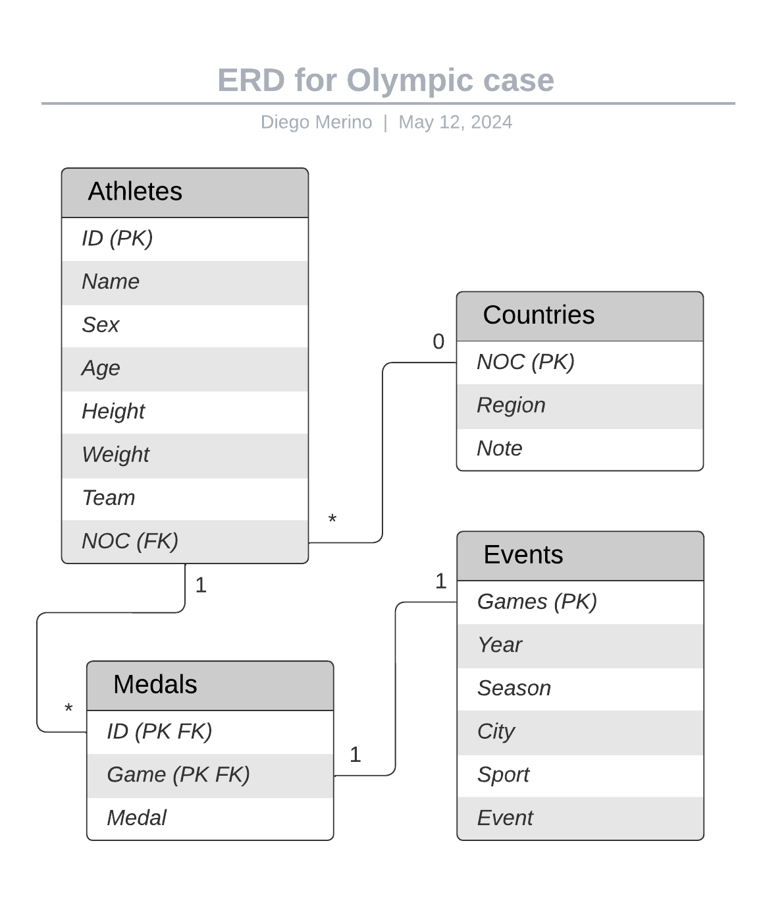

# Milestone 1: Project Proposal and Data Selection/Preparation.
## Project guideline

### Project Proposal 
For this project, I aim to understand the performance of different countries or regions (NOC) in specific sports over time, the evolution of their participation in the Olympic Games, and the patterns or trends in athletes’ performance related to factors such as age, height, and weight.

### Questions: 
Q1: Which countries or regions (NOC) have had better performance in specific sports over time? 
Q2: How has the participation of different countries and regions (NOC) in the Olympic Games evolved over the years, and how does their performance compare to each other? 
Q3: Are there patterns or trends in athletes, performance related to factors such as age, height, and weight?

### Initial Hypotheses: 
H1: Certain countries/regions have consistently dominated in specific sports due to cultural factors, sports programs, and geographical conditions. 
H2: Athletes in strength and endurance sports tend to be in an optimal age and physical characteristics range. 
H3: The participation of developing countries/regions has increased in recent decades, showing greater diversity in the Olympic Games. H4: There is a positive correlation between optimal physical characteristics (height, weight) and success in certain sports.

### 01. Which client/dataset did you select and why?
I selected the Client 3: SportsStats (Olympics Dataset - 120 years of data)

SportsStats is a sports analysis firm partnering with local news and elite personal trainers to provide “interesting” insights to help their partners. Insights could be patterns/trends highlighting certain groups/events/countries, etc. for the purpose of developing a news story or discovering key health insights.

I chose this dataset due to the smaller file size compared to the other options.

### 02. Describe the steps you took to import and clean the data.
As the data is available in a CSV file, I imported it into a Notebook to perform my first analyzes using Python. To perform the cleanup I removed duplicate values, to understand the number of athletes involved in the games, and also some of the empty values.

